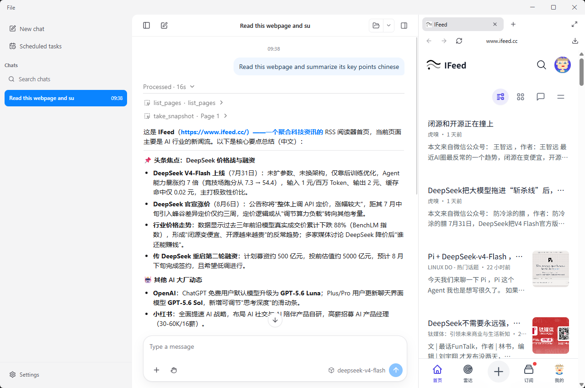

# Moke

Moke is a local AI work assistant. Describe a goal in natural language, and it can search for information, operate within a folder you choose, use its built-in browser, and turn the results into something useful.

In short: **Moke does more than answer questions. It can open pages, click, type, read files, and call tools for you.**

> Moke is still in early development. It is suitable for personal use and experimentation, but is not recommended for unattended production workflows.



## What It Can Do

Moke is designed for tasks that involve finding information, taking a few actions, and delivering a result:

- Research a topic across multiple sources and include useful links
- Compare webpages or documents and highlight differences in prices, terms, dates, or other details
- Organize files in a workspace and extract names, amounts, decisions, or action items
- Use the web: search, open links, click buttons, scroll pages, and fill out forms
- Turn research into notes, reports, or a clear list of next steps
- Connect local tools and MCP services to access more data or capabilities

Its basic workflow is deliberately short:

```text
Describe a goal -> Moke plans steps -> Browse/use tools -> Ask for confirmation when needed -> Summarize the result
```

## How It Differs

| Tool | Main strength | How Moke differs |
| --- | --- | --- |
| Chatbot | Explains ideas and generates text | Moke can open pages, operate websites, and read files in your workspace |
| Browser AI | Answers questions about the current page | Moke includes browser actions in the task flow and can work across pages |
| Traditional RPA/scripts | Reliable fixed steps, but requires upfront programming | Moke uses natural language for tasks whose exact steps are not known in advance |
| Cloud agent | Convenient, with data and execution hosted in the cloud | Moke runs locally first, so you control the workspace, browsing data, and tool permissions |

Moke is not trying to automate everything without oversight. It focuses on low cost, visible execution, and confirmation for actions that write data or affect external systems.

## Getting Started

### Option 1: Local development mode (browser UI)

You need Node.js 20 or later and an available OpenAI-compatible model service. The model can run locally or be provided by a remote API.

```bash
git clone <repository-url>
cd moke
npm install
cp .env.example .env
```

On Windows PowerShell, use `Copy-Item .env.example .env` instead of `cp`.

Edit `.env` and confirm at least these settings:

```dotenv
OPENAI_API_KEY=your-model-service-key
OPENAI_MODEL=your-model-name
OPENAI_BASE_URL=https://your-model-service.example/v1
```

Start Moke:

```bash
npm run dev
```

The terminal will print the frontend URL, usually `http://127.0.0.1:5173`. Open it in your browser and:

1. Choose a workspace folder. Moke can access and save files only within this boundary.
2. Open Settings and test the model connection if needed.
3. Start a new chat and describe the task, for example: `Read the meeting notes in this folder and list the decisions, owners, and deadlines.`

### Option 2: Desktop mode

The built-in browser and some file capabilities require the desktop app. In a development environment, run:

```bash
npm run desktop
```

Use browser development mode for conversation testing or basic web reading. Use desktop mode when Moke needs to open and operate webpages as part of a task.

## Important Concepts

### Workspace

Every chat is attached to a workspace, which is a local folder. Moke treats it as the project boundary for reading files, creating files, and saving screenshots. To work on another project, choose a different folder and create a new chat.

### Permission modes

The chat permission setting controls the operating-system boundary used for shell commands:

- **Read-only**: commands can read files, but filesystem writes are blocked
- **Workspace write**: commands can write inside the selected workspace, while writes outside it are blocked
- **Full access**: shell commands run without filesystem confinement; use only in an environment you fully trust

The API field remains named `approval_mode`. Access to external paths and tools may still be governed by their own authorization rules.

### Model services

Moke uses an OpenAI-compatible API, so it can connect to local inference servers or compatible cloud services. Keep API keys in the local `.env` file or application settings. Do not commit them to Git or paste them into chat messages.

### MCP tools (optional)

MCP is a standard way to add tools to Moke, such as database, knowledge-base, or other local services. Most users can skip this at first. When you do configure one, add it in Settings and explicitly allow it to start. MCP tools require approval by default; only tools you explicitly mark as read-only skip tool approval.

## Common Commands

```bash
npm run dev             # Start development mode
npm run desktop         # Start desktop development mode
npm run typecheck       # Run type checking
npm test                # Run tests
npm run build           # Build the client
npm run package:desktop # Package the desktop app
```

## Design Approach

Many real tasks are difficult not because the final text is hard to generate, but because the assistant needs context and must complete several connected actions. Moke therefore puts conversation, browsing, the workspace, and tools into one execution loop.

The project follows a few boundaries:

- **Local first**: the server, sessions, and browsing data can run locally; you choose the workspace
- **Visible tools**: execution status, tool calls, and results are shown so failures can be traced
- **Layered permissions**: read, write, external-path, and external-tool access are handled separately, with confirmation for important actions
- **Small and extensible**: cover common information tasks first, then add capabilities through MCP and skills instead of shipping everything upfront

## Project Status

Moke is an actively evolving experimental project. The interface, configuration options, and agent behavior may change. If you want to contribute, start with `apps/` for applications, `packages/` for shared capabilities, and `docs/` for design documents.
